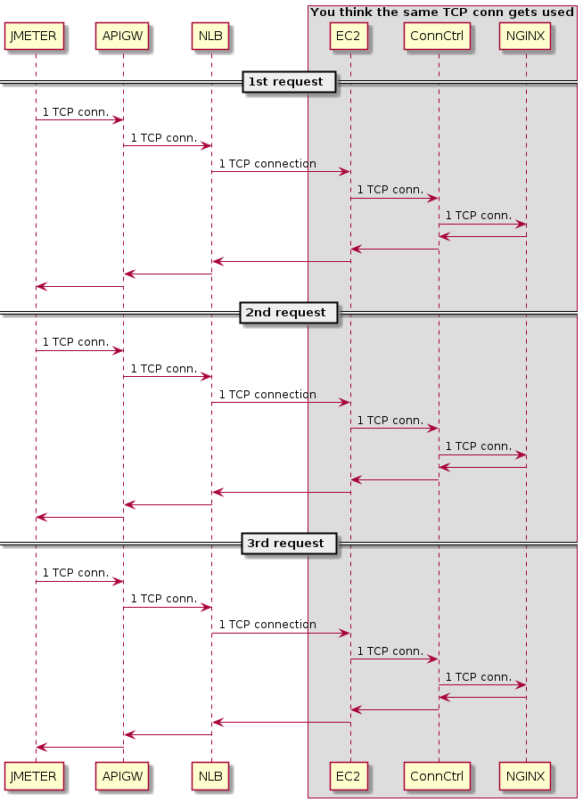

# System wide TCP Connection Behavior

The following sequence diagram shows the basic architecture that was tested. 

__FALSE ASSUMPTION:__ 1 client TCP connection will only ever result in 1 TCP conneciton at all levels of the pipeline

This assumption leads us to believe that the following happens...




# Raw Diagrams

Mistaken
```
@startuml
participant JMETER
participant APIGW
participant NLB
box "You think the same TCP conn gets used"
participant EC2
participant ConnCtrl
participant NGINX
end box

== 1st request ==
JMETER -> APIGW : 1 TCP conn.
APIGW -> NLB : 1 TCP conn.
NLB -> EC2 : 1 TCP connection
EC2 -> ConnCtrl : 1 TCP conn.
ConnCtrl -> NGINX : 1 TCP conn.
ConnCtrl <- NGINX
EC2 <- ConnCtrl
NLB <- EC2
APIGW <- NLB
JMETER <- APIGW
== 2nd request ==
JMETER -> APIGW : 1 TCP conn.
APIGW -> NLB : 1 TCP conn.
NLB -> EC2 : 1 TCP connection
EC2 -> ConnCtrl : 1 TCP conn.
ConnCtrl -> NGINX : 1 TCP conn.
ConnCtrl <- NGINX
EC2 <- ConnCtrl
NLB <- EC2
APIGW <- NLB
JMETER <- APIGW
== 3rd request ==
JMETER -> APIGW : 1 TCP conn.
APIGW -> NLB : 1 TCP conn.
NLB -> EC2 : 1 TCP connection
EC2 -> ConnCtrl : 1 TCP conn.
ConnCtrl -> NGINX : 1 TCP conn.
ConnCtrl <- NGINX
EC2 <- ConnCtrl
NLB <- EC2
APIGW <- NLB
JMETER <- APIGW
@enduml
